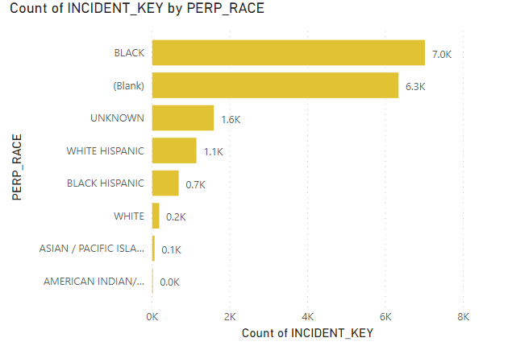
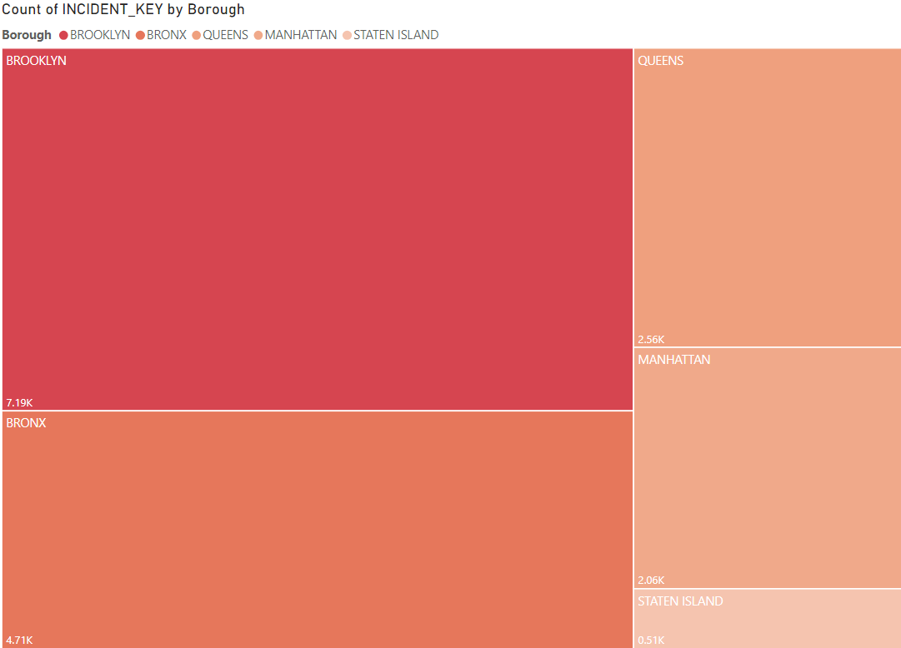
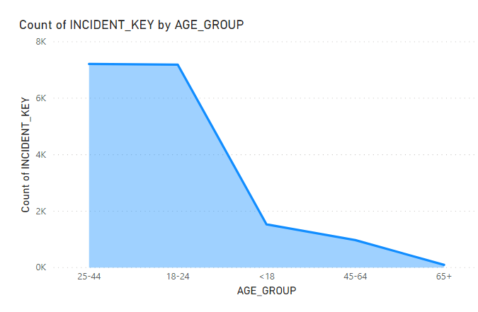

# NYPD Data Warehouse & Business Intelligence

End-to-end data integration and BI pipeline built on NYC Open Data — covering NYPD complaints, criminal court summons, and shooting incidents from 2006–2019.

---

## Project Overview

This project demonstrates a full data warehouse lifecycle: source data extraction from NYC OpenData, staging and dimensional modeling in MySQL, ETL via Talend, and visualization in both Tableau and Power BI.

**Datasets (NYC OpenData)**

| Dataset | Rows | Source Link |
|---|---|---|
| NYPD Complaint Data Historic (2006–2018) | ~6.85M | [Link](https://data.cityofnewyork.us/Public-Safety/NYPD-Complaint-Data-Historic/qgea-i56i) |
| NYPD Complaint Data YTD (2019) | ~462K | [Link](https://data.cityofnewyork.us/Public-Safety/NYPD-Complaint-Data-Current-Year-To-Date-/5uac-w243) |
| NYPD Criminal Court Summons Historic | ~5.26M | [Link](https://data.cityofnewyork.us/Public-Safety/NYPD-Criminal-Court-Summons-Historic-/sv2w-rv3k) |
| NYPD Shooting Incident Data Historic | ~21.4K | [Link](https://data.cityofnewyork.us/Public-Safety/NYPD-Shooting-Incident-Data-Historic-/833y-fsy8) |

All datasets are provided by the **NYC Police Department (NYPD)** and published by **NYC OpenData**.

---

## Tools & Technologies

| Category | Tool |
|---|---|
| Data Modeling | ER/Studio (`.DM1`) |
| Database | MySQL 5.x (MyISAM engine) |
| ETL / Data Integration | Talend Real-Time Data Platform 7.1 |
| Business Intelligence | Microsoft Power BI |
| Data Visualization | Tableau |
| Query & Admin | Microsoft SQL Server Management Studio |

---

## Repository Structure

```
NYPD-DataWarehouse-BI/
│
├── data_model/
│   └── NYPD_Dim_Model.DM1               # ER/Studio dimensional model
│
├── sql/
│   ├── NYPD_Dimensional_Schema.sql      # Dim + Fact table DDL (star schema)
│   └── NYPD_Staging_Schema.sql          # Staging table DDL (raw ingestion layer)
│
├── etl/
│   └── NYPD_Talend_Jobs.zip             # Talend job exports
│
├── visualizations/
│   ├── tableau/
│   │   ├── NYPD_Complaints.twb
│   │   ├── NYPD_Criminal_Summons.twb
│   │   └── NYPD_Shooting.twb
│   └── powerbi/
│       └── NYPD_Shooting_Power_BI.pbix
│
├── docs/
│   └── NYPD-Workshop-Complaints.pdf     # Workshop reference slides
│
├── images/
│
└── README.md
```

> **Note on current file names:** The root-level `MySQLScript` (no extension) contains the dimensional schema DDL and should be renamed to `sql/NYPD_Dimensional_Schema.sql`. The `MySQL_Staging_Script.sql` maps to `sql/NYPD_Staging_Schema.sql`.

---

## Architecture

```
NYC OpenData (CSV/TSV)
        │
        ▼
  Staging Layer          ← Stg_Complaints, Stg_Criminal_Court_Summons,
  (MySQL)                   Stg_Shooting_Incident
        │
        ▼  Talend ETL (transform + load)
        │
  Dimensional Layer      ← Star Schema
  (MySQL)                   Fact: Fact_Complaints, Fact_Criminal_Court_Summons,
                                   Fact_Shooting_Incident
                            Dims: Dim_Complaints_Borough, Dim_KY_Code,
                                   Dim_PD_Code, Dim_PERP_Age_Group,
                                   Dim_PERP_RACE, Dim_VIC_Age_Group,
                                   Dim_VIC_RACE
        │
        ▼
  BI Layer               ← Tableau (.twb) + Power BI (.pbix)
```

---

## Data Model

The dimensional model follows a **star schema** pattern with three fact tables sharing a common set of dimension tables.

**Fact Tables**

- `Fact_Complaints` — one row per NYPD complaint; includes offense classification, precinct, date/time range, location, and foreign keys to all shared dimensions
- `Fact_Criminal_Court_Summons` — one row per summons issued; includes offense description, law section, summons category, and perpetrator demographics
- `Fact_Shooting_Incident` — one row per shooting incident; includes occurrence date/time, murder flag, location, and perpetrator/victim demographics

**Dimension Tables**

| Table | Key Column | Description |
|---|---|---|
| `Dim_Complaints_Borough` | `BORO_SK` | NYC borough lookup |
| `Dim_KY_Code` | `KY_SK` | 3-digit offense classification |
| `Dim_PD_Code` | `PD_SK` | Granular internal PD classification |
| `Dim_PERP_Age_Group` | `PERP_AGE_SK` | Perpetrator age bracket |
| `Dim_PERP_RACE` | `PERP_RACE_SK` | Perpetrator race description |
| `Dim_VIC_Age_Group` | `VIC_AGE_SK` | Victim age bracket |
| `Dim_VIC_RACE` | `VIC_RACE_SK` | Victim race description |

Surrogate keys (`_SK` suffix) are auto-incremented integers. `DI_PID` and `DI_Create_DT` are data integration audit columns present on every table.

---

## ETL Pipeline (Talend)

Talend jobs handle the full extract-transform-load flow:

1. **Extract** — read CSV/TSV source files from disk
2. **Stage** — load raw records into staging tables (`Stg_*`) with minimal transformation
3. **Transform** — deduplicate dimension values, resolve surrogate keys, apply type casting
4. **Load** — populate dimensional fact and dimension tables

Talend job exports are located in `etl/NYPD_Talend_Jobs.zip`.

---

## BI Dashboards

### Power BI — Shooting Incidents
Three report pages covering:
- **Incident count by perpetrator age group** — 25–44 and 18–24 are the highest-volume brackets
- **Incident count by borough** — Brooklyn leads (~7.19K), followed by the Bronx (~4.71K), Queens (~2.56K), Manhattan (~2.06K), and Staten Island (~0.51K)
- **Incident count by perpetrator race** — with a significant proportion of records missing race data (blank/unknown)





### Tableau
Three workbooks targeting the complaints, criminal summons, and shooting datasets respectively.

---

## Setup & Reproduction

### Prerequisites
- MySQL 5.x
- Talend Real-Time Data Platform 7.1
- Tableau Desktop (to open `.twb` files)
- Power BI Desktop (to open `.pbix` files)

### Steps

1. **Create the database schema**
   ```sql
   -- Run staging schema first
   source sql/NYPD_Staging_Schema.sql;

   -- Then run the dimensional schema
   source sql/NYPD_Dimensional_Schema.sql;
   ```

2. **Download source data** from the NYC OpenData links above and place CSVs in a local `/data/` directory.

3. **Run Talend jobs** — import `etl/NYPD_Talend_Jobs.zip` into your Talend workspace and configure the MySQL connection parameters, then execute jobs in order: staging load → dimension load → fact load.

4. **Connect BI tools** — open the `.twb` / `.pbix` files and update the MySQL data source connection to point to your local instance.

---

## Key Observations

- Shooting incidents are heavily concentrated in Brooklyn and the Bronx, which together account for over 65% of recorded incidents.
- Perpetrators aged 25–44 and 18–24 represent the largest age groups across shooting incidents.
- A substantial share of perpetrator race records are blank or unknown, which is worth flagging as a data quality consideration in any downstream analysis.

---

## Data Dictionary References

Full column descriptions are available in the attached workshop PDF (`docs/NYPD-Workshop-Complaints.pdf`) and in the official NYC OpenData data dictionaries linked above.

---

## License

Source data is publicly available via [NYC OpenData](https://opendata.cityofnewyork.us/) under the [NYC Terms of Use](https://www1.nyc.gov/home/terms-of-use.page). This repository contains only schema definitions, ETL job configs, and BI workbooks — no raw source data is included.